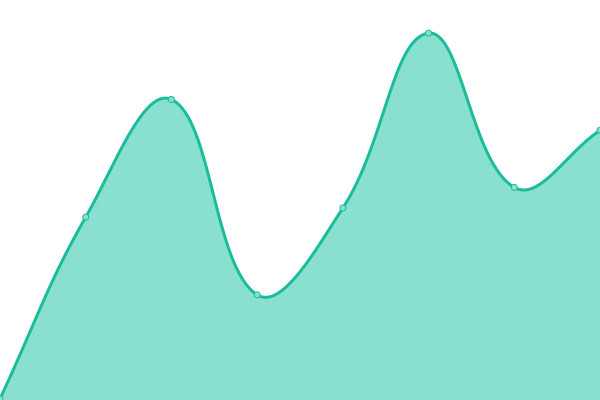

# [📈 实时状态](https://jk.web404.cf): <！ -实时状态- > **所有系统都可以正常运行**

This repository contains the open-source uptime monitor and status page for [JYFUX](https://jk.web404.cf), powered by [Upptime](https://github.com/upptime/upptime).

With [Upptime](https://upptime.js.org), you can get your own unlimited and free uptime monitor and status page, powered entirely by a GitHub repository. We use [Issues](https://github.com/JYFUX/upptime/issues) as incident reports, [Actions](https://github.com/JYFUX/upptime/actions) as uptime monitors, and [Pages](https://jk.web404.cf) for the status page.

## [📈 Live Status](https://demo.upptime.js.org): <!--live status--> **🟥 全部停机**

<!--start: status pages-->
<!-- This summary is generated by Upptime (https://github.com/upptime/upptime) -->
<!-- Do not edit this manually, your changes will be overwritten -->
<!-- prettier-ignore -->
| 链接 | 状态 | 历史 | 响应时间 | 正常运行时间 |
| --- | ------ | ------- | ------------- | ------ |
|  Glitch | 🟥 停机 | [glitch.yml](https://github.com/JYFUX/upptime/commits/HEAD/history/glitch.yml) | 

 8273毫秒
     
 | 

<a href="https://jk.web404.cf/history/glitch">50.07%</a>
    

<!--end: status pages-->

[**Visit our status website →**](https://jk.web404.cf)

## 📄 License

- Powered by: [Upptime](https://github.com/upptime/upptime)
- Code: [MIT](./LICENSE) © [JYFUX](https://jk.web404.cf)
- Data in the `./history` directory: [Open Database License](https://opendatacommons.org/licenses/odbl/1-0/)
